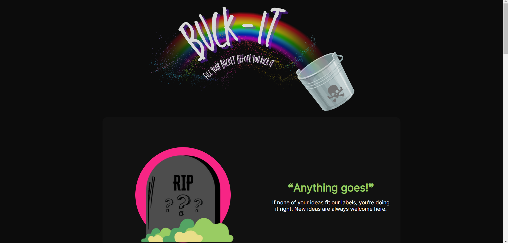

 
  

# Overview
*__Life is short.__* You should spend more time *__filling your bucket__* 🌈🪣 before you *__kick it__* 💀🪣. Enter **Buck-It!**... the app with all the inspiration you need to make your own bucket list and live life to its fullest!

To use Buck-It!, browse through the categories for the types of activities you are interested in. Choose from **Let's Get Wild** (Thrills), **It's Never Too Late** (Relationships), **Entertain Me** (Movies, Books, Music, Theater, etc.), **X Marks the Spot** (Travel), **Yummy** (Food), and **Anything Goes** (Misc). Each category holds a list of ideas. When you click on each idea, you can view comments from other users and hear about their experience. Add your own comments to let others know if you've done it and if it was as awesome as you thought it would be. Having second thoughts about telling your story? You can edit or delete your comment. Have an amazing idea that isn't on the list yet? Add it to one of the categories and inspire others to to experience it, too. 

 
  

 

**********

## Buck-It! Demo

 
 
 

**********

## Technologies used in this app:
* React (https://reactjs.org/) Version 18.2.0
* React-Router-Dom (https://www.npmjs.com/package/react-router-dom) Version 6.8.1
* Express Version (https://expressjs.com/) 4.18.2
* Sequelize Version (https://sequelize.org/) 6.28.0
* Node-Postgres (https://www.npmjs.com/package/pg) Version 8.9.0

## Collaborators:
* Alice Weng
* Diana Cano
* Aisha Rincon
* Jennifer Stephens

